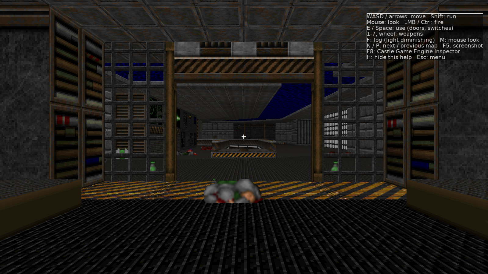
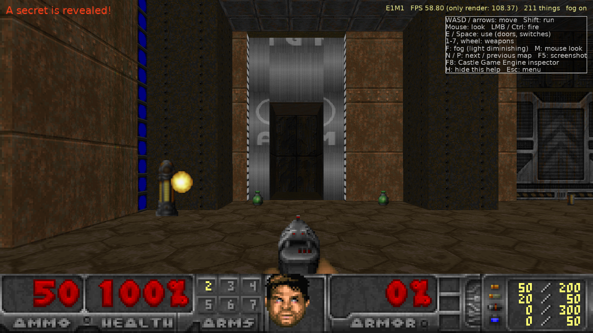
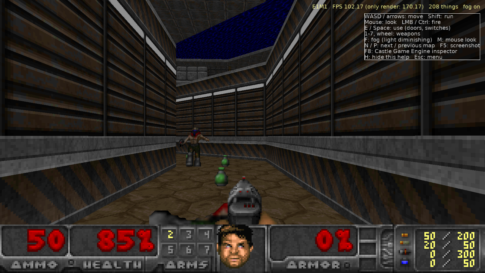
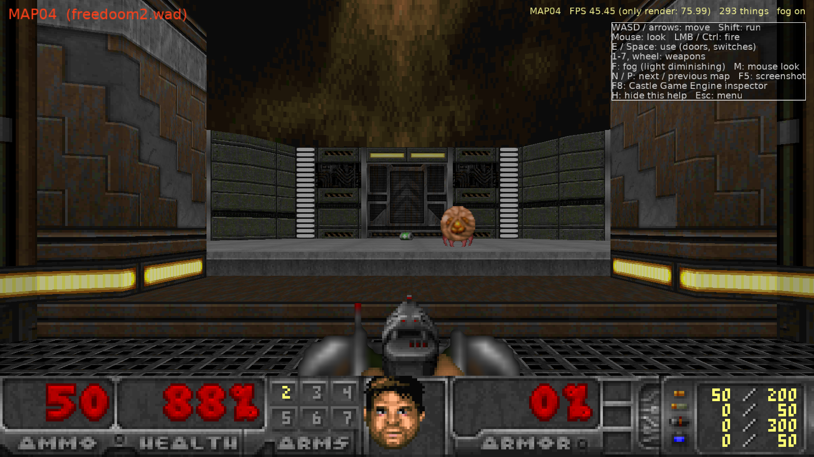
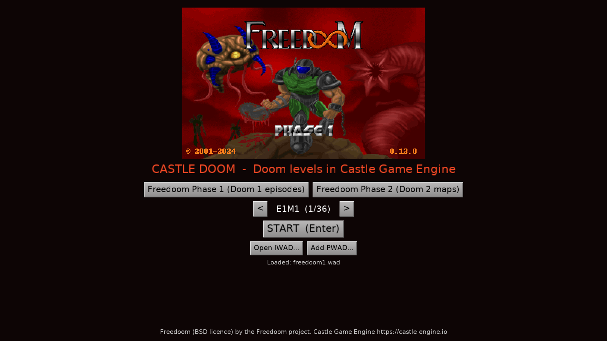

# Castle DOOM

[](https://github.com/mariuz/castle-doom/actions/workflows/build.yml)
[](https://github.com/mariuz/castle-doom/actions/workflows/web.yml)

**Play in the browser: https://mariuz.github.io/castle-doom/** (WebAssembly build)
&middot; **Downloads: [Releases](https://github.com/mariuz/castle-doom/releases)** (Windows, Linux) &middot; [Changelog](docs/CHANGELOG.md)

Doom levels, rendered and played with [Castle Game Engine](https://castle-engine.io/)
(Object Pascal). It reads the original WAD format directly: Freedoom Phase 1 and
Phase 2 (BSD licensed, bundled in `data/wads/`) work out of the box, and your own
vanilla-format Doom 1 / Doom 2 IWADs and PWADs can be loaded from the menu
("Open IWAD...", "Add PWAD...") or the command line:

```bash
castle-doom -iwad DOOM2.WAD -file mymap.wad -warp MAP01
```

This project is deliberately written as a *tour of the engine*: every Doom subsystem
is mapped onto a Castle Game Engine feature.



| | |
|---|---|
|  |  |
|  |  |

| Doom | Castle Game Engine |
|---|---|
| WAD lumps (`VERTEXES`, `LINEDEFS`, `SECTORS`, BSP `NODES`...) | `DoomWad` / `DoomMap` units, plain Pascal records |
| Walls, floors, ceilings | X3D nodes built in code: `TIndexedTriangleSetNode`, `TUnlitMaterialNode`, per-vertex `TColorNode` for sector light, one `TCastleScene` per movable sector |
| Textures (`TEXTURE1` + `PNAMES` patch composition, flats, sprites) | decoded to `TRGBAlphaImage`, served through a custom URL protocol `doomgfx:/tex/STARTAN3.png` (`RegisterUrlProtocol`) so the engine's texture cache shares them between scenes |
| Animated flats/walls (NUKAGE, BFALL...) | `TImageTextureNode.SetUrl` swapped every 8 tics |
| Sky | a textured cylinder scene that follows the camera |
| Light diminishing | Doom's colormap arithmetic as a GLSL shader effect (`TEffectNode`, a `FloatVertexAttribute` with the sector light), with the gun flash light, invulnerability and light amplification colormaps (toggle with `F`) |
| Player | `TCastleWalkNavigation`: gravity, `PreferredHeight` 41, `ClimbHeight` 24 (stairs), `Radius`, mouse look, head bobbing; collisions via `PreciseCollisions` on the map scenes |
| Things / monsters | one `TCastleTransform` per thing with a `TCastleBillboard` behavior and a quad `TCastleScene`; sprite rotations picked like `R_ProjectSprite` |
| Shooting | Doom's autoaim (`P_AimLineAttack`) and line attacks traced in Doom units against linedefs and thing boxes |
| Doors, lifts, floors, ceilings, stairs, crushers | sector height changes regenerate the affected `TCastleScene` coordinates in place |
| Sounds (`DS*` DMX lumps) | converted to WAV on the fly via `doomsfx:/DSPISTOL` URL protocol, positional audio with `TCastleSoundSource` |
| Music (`D_*` MUS or MIDI lumps + `GENMIDI` OPL patches) | a small OPL2-style FM synthesizer in `DoomMusic` renders the song to WAV (`doommus:/D_E1M1.wav`), looped on `SoundEngine.LoopingChannel[0]` |
| Status bar | `STBAR` + digit patches composed into one image shown by a pixel-perfect `TCastleImageControl` |
| Weapon sprites, flashes, screen flashes, messages | `TCastleImageControl`, `TCastleRectangleControl`, `TCastleLabel` |
| Title / intermission | `TCastleView`s |

**Read [docs/ARCHITECTURE.md](docs/ARCHITECTURE.md)** for a unit-by-unit explanation of how
the port works and which engine APIs each part uses; [docs/ROADMAP.md](docs/ROADMAP.md) lists
what is still missing, prioritized; [CLAUDE.md](CLAUDE.md) has build, test and contribution notes.

## What works

- Freedoom Phase 1 (36 ExMy maps) and Phase 2 (32 MAPxx maps), map selection in the menu.
- Textured walls with Doom's pegging rules and offsets, masked middle textures (grates),
  floors and ceilings from BSP subsectors, sky, sector light levels with "fake contrast".
- Doors (manual, switch, walk-over, locked, blazing), lifts (perpetual ones stop and
  resume), floors (raise to the shortest lower texture, donuts), ceilings, crushers
  (slow ones slow down on what they crush, silent ones, stop and resume), stairs, teleporters, light changes, scrolling walls, switch textures, secret sectors,
  damaging floors, exits (normal and secret) with an intermission screen.
- Pickups: health, armor, ammo, keys, weapons, powerups, with Doom's messages.
- Monsters wake up like in Doom: on sight in front of them, or when your shots reach their
  sector (sound spreads through open doors, stops at closed ones and crosses at most one sound-blocking
  line; ambush monsters must also see you). They chase (2D Doom-style movement with step/drop-off
  rules, they open doors and use teleporters and monster-only teleport lines; spectres are
  drawn as shimmering fuzz; flyers rise and sink towards you like Doom's `P_ZMovement`
  and their corpses fall), attack with melee, hitscan or projectiles, take pain, die
  (or burst into gibs when overkilled), get knocked back by hits and explosions (so do you),
  are squashed to gibs as corpses under closing doors and crushers, drop items, and fight each other when hit by another monster (infighting). Lost souls
  charge, Pain Elementals spit lost souls (three more when they die), Arch-viles raise
  the dead and burn you with their fire attack. Barrels explode with splash damage. Boss deaths trigger the special map events (E1M8, E2M8,
  E3M8, E4M6, E4M8, MAP07, Commander Keen). The Icon of Sin on MAP30 spits cubes that
  spawn monsters and dies to rockets through the hole in its wall.
- Weapons: fist, chainsaw, pistol, shotgun, super shotgun, chaingun, and real projectiles
  for the rocket launcher (splash damage), plasma gun and BFG (charge, ball, tracer spray).
  Punches and the chainsaw turn you towards what they hit, like in Doom.
- Status bar with face, keys, arms, ammo table; weapon bobbing, weapons lowered and raised
  when switching; damage, pickup and radiation-suit tints from the WAD's palettes; Doom's
  screen melt between levels.
- Automap (Tab) with Doom's line colours, player arrow, zoom, grid and a reveal-all cheat.
- Doom's text font for messages, and the real intermission screen (level names, FINISHED,
  animated kills/items/secrets/time with sounds, par times, ENTERING).
- Freedoom's own wording from the WAD's `DEHACKED` strings: pickup and door messages, level
  titles (also on the automap), the Nightmare and quit questions.
- Finales: Freedoom's story texts (read from the WAD's `DEHACKED` strings), the end
  pictures, the bunny scroller after E3M8 and the Doom 2 cast call after MAP30.
- Doom's own menu from the WAD's graphics: New Game, episode and skill select (all five
  skills, with Nightmare's fast monsters and respawning), Load Game; `-skill 1..5`.
  The Options page picks WADs, map and skill.
- Save and load: F2 / F3 slot menus, F6 / F9 quick save / load, "Continue (quick save)" on
  the title screen, `-loadgame N`. Everything is saved: open doors, moving lifts, used
  switches, corpses, monsters mid-fight, inventory and the automap. In the browser saves
  are kept in the page's `localStorage`, so they survive reloads; the home page's "Your
  saves" section exports them to a file and imports them back, and the desktop build reads
  the same file (Options: Export / Import saves, `--export-saves` / `--import-saves`).
- External IWADs and PWADs (menu file dialogs or `-iwad` / `-file` / `-warp`), PWAD lumps
  overriding the IWAD's like in Doom; vanilla and ZDoom extended nodes (`XNOD`, `ZNOD`,
  `XGLN`/`ZGLN`, `XGL2`/`ZGL2`, `XGL3`/`ZGL3`), so maps built with ZDBSP load too.
- Music: MUS and MIDI lumps played through an FM synthesizer driven by the WAD's GENMIDI
  instrument bank (the AdLib / Sound Blaster sound of the original), title, level and
  intermission tracks.

## Not (yet) done

See [docs/ROADMAP.md](docs/ROADMAP.md). Headlines: no glBSP `GL_` lumps or UDMF maps, no
`-deh` files, the music synth approximates the OPL2.

## Build and run

Install Castle Game Engine 7 (its Windows download bundles Free Pascal), then
(on Windows, copy `OpenAL32.dll` and `wrap_oal.dll` from the engine's `bin/` next to the
executable for sound; `castle-engine package` does that automatically):

```bash
castle-engine compile --mode=release
castle-engine run
```

or open `CastleEngineManifest.xml` in the Castle Game Engine editor.

Keys: `WASD`/arrows move, `Shift` run, mouse look, left mouse / `Ctrl` fire,
`E`/`Space` use, `1`-`7` and mouse wheel weapons, `F` light diminishing, `M` mouse look on/off,
`J` music on/off, `F4` sound / music volume, `Tab` automap (`+`/`-`/wheel zoom, `G` grid, `I` reveal all),
`F2`/`F3` save/load menu, `F6`/`F9` quick save/load, `N`/`P` next/previous map,
`F5` screenshot, `F8` engine inspector, `H` help, `Esc` pause (click or `Enter` resumes, `Esc`
again goes to the title menu; in the browser, Esc releasing the mouse pauses the same way and a
click takes the mouse back).

Automated smoke test (loads a map, runs a script, saves screenshots, quits):

```bash
castle-doom --autotest E1M1 shots/e1m1 --demo "S,F:3,S,T:90,U,W:2,S,X,S,Q"
```

## Continuous integration

- `.github/workflows/build.yml`: packages Windows x86_64 and Linux x86_64 builds on every
  push using the [Castle Game Engine Docker image](https://castle-engine.io/docker); pushing a
  tag `vX.Y.Z` attaches them to a GitHub Release.
- `.github/workflows/web.yml`: builds the WebAssembly version (FPC main branch with the
  wasm32 cross-compiler and Pas2js are built from source and cached, since the Docker image
  does not ship them yet) and deploys `pages/` + the game to GitHub Pages.

## Source layout

```
code/doomwad.pas        WAD directory and palette
code/doomgraphics.pas   patches, textures, flats, sprites, animations, doomgfx: protocol
code/doommap.pas        map lumps, BSP queries, subsector polygons
code/doomgeometry.pas   map -> X3D scenes (chunks that can be regenerated)
code/doomthings.pas     thing type table (info.c reduced)
code/doomactors.pas     sprite billboards with frame animation
code/doomworld.pas      game logic: movers, specials, pickups, AI, weapons
code/doomsound.pas      DMX -> WAV, doomsfx: protocol
code/doommusic.pas      MUS/MIDI parsing, GENMIDI FM synthesizer, doommus: protocol
code/doomhud.pas        status bar composition
code/doomautomap.pas    automap (DrawPrimitive2D)
code/doomfont.pas       STCFN text
code/doomintermission.pas  intermission screen
code/doomfinale.pas     finale text, end pictures, bunny scroller, cast call
code/doomdehacked.pas   BEX strings from DEHACKED lumps
code/doomwipe.pas       the screen melt
code/doommenu.pas       Doom's menu (M_* graphics): main, episode, skill, load
code/gameviewmenu.pas   title screen: Doom menu and options
code/gameviewplay.pas   viewport, navigation, HUD, input
```

Freedoom is Copyright (c) 2001-2024 Contributors to the Freedoom project, BSD licence
(see `data/wads/COPYING.txt`). Castle Game Engine is LGPL with static linking exception.
